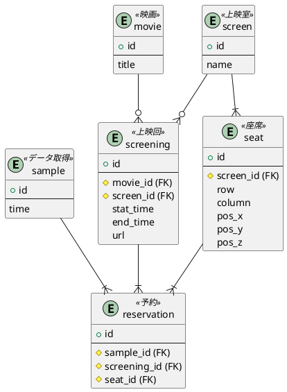

# MTRA
Movie Theater Reservation Analyzer


## データベース ##



```sql
create database `mtra`;

use `mtra`;

create table `sample`(
  `id` int auto_increment not null primary key,
  `time` datetime);

CREATE TABLE `movie` (
  `id` int NOT NULL AUTO_INCREMENT,
  `title` varchar(256) CHARACTER SET utf8mb4 COLLATE utf8mb4_bin NOT NULL,
  PRIMARY KEY (`id`),
  UNIQUE KEY `title` (`title`)
) ENGINE=InnoDB DEFAULT CHARSET=utf8mb4 COLLATE=utf8mb4_bin

create table `screen`(
  `id` int auto_increment not null primary key,
  `name` text not null);

CREATE TABLE `screening` (
  `id` int NOT NULL AUTO_INCREMENT,
  `movie_id` int NOT NULL,
  `screen_id` int NOT NULL,
  `start_time` datetime DEFAULT NULL,
  `end_time` datetime DEFAULT NULL,
  `url` text,
  PRIMARY KEY (`id`),
  KEY `movie_id` (`movie_id`),
  KEY `screen_id` (`screen_id`),
  CONSTRAINT `screening_ibfk_1` FOREIGN KEY (`movie_id`) REFERENCES `movie` (`id`),
  CONSTRAINT `screening_ibfk_2` FOREIGN KEY (`screen_id`) REFERENCES `screen` (`id`)
) ENGINE=InnoDB DEFAULT CHARSET=utf8mb4 COLLATE=utf8mb4_bin

create table seat(
  `id` int auto_increment not null primary key,
  `screen_id` int not null,
  `row` char(2),
  `column` int,
  `pos_x` double,
  `pos_y` double,
  `pos_z` double,

  foreign key (`screen_id`)
  references `screen`(`id`));

create table `reservation`(
  `id` bigint auto_increment not null primary key,
  `sample_id` int,
  `screening_id` int,
  `seat_id` int,

  foreign key(`sample_id`)
  references `sample`(`id`),

  foreign key(`screening_id`)
  references `screening`(`id`),

  foreign key(`seat_id`)
  references `seat`(`id`));

insert into screen(name) values ("a studio");

insert into seat(`screen_id`, `row`, `column`, `pos_x`, `pos_y`, `pos_z`) values (1, "B",  5, -13,   1,   0);

```
