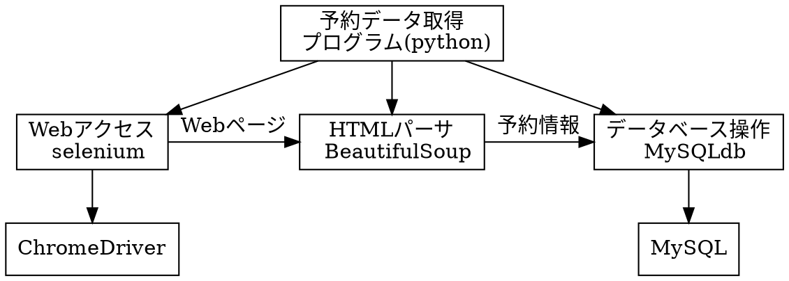
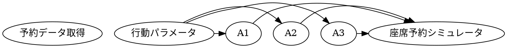

##予約データ取得プログラムのブロック図

```dot
digraph G {
  node[shape=box]
  A->B
  A->C
  A->D
  B->C [label="Webページ"]
  C->D [label="予約情報"]
  B->E
  D->F
  A [label="予約データ取得
  プログラム(python)"]
  {
    rank = same
  B [label="Webアクセス
  selenium"]
  C [label="HTMLパーサ
  BeautifulSoup"]
  D [label="データベース操作
  MySQLdb"]
  }
  {
    rank = sample
    E [label="ChromeDriver"]
    F [label="MySQL"]
  }
}
```

```dot
digraph G {
  予約データ取得
  subgraph MAS {
    subgraph Agent {
      A1 -> A2 -> A3 [style="invis"]
    }
    rank = same
    行動パラメータ -> A1
    行動パラメータ -> A2
    行動パラメータ -> A3
    A1 ->座席予約シミュレータ
    A2 ->座席予約シミュレータ
    A3 ->座席予約シミュレータ
  }
}
```
